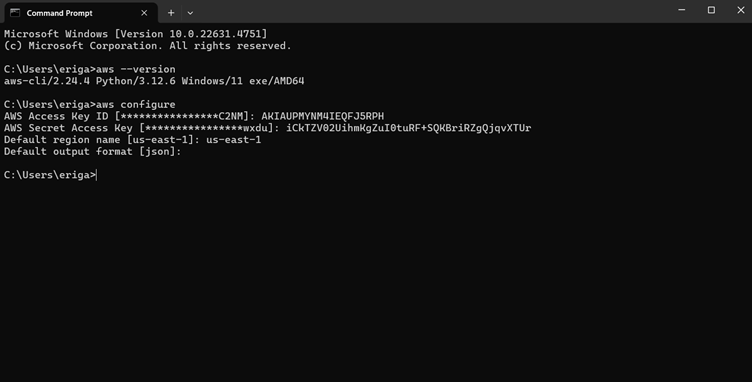
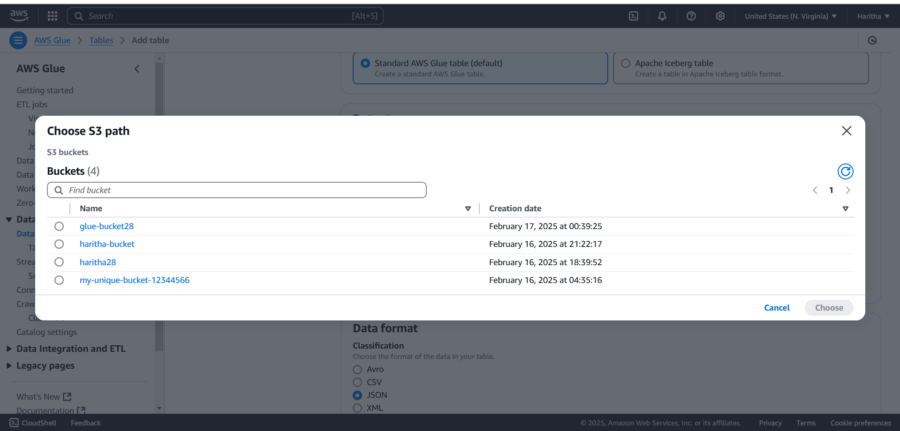

# AWS
# AWS CLI, IAM, S3, and AWS Glue

## AWS CLI
AWS Command Line Interface (CLI) is a tool that enables users to interact with AWS services using command-line commands. It provides an efficient and automated way to manage AWS resources without using the AWS Management Console. The AWS CLI supports multiple operating systems and can be integrated into scripts and automation workflows.

### Features of AWS CLI:
- Simplifies interaction with AWS services.
- Supports automation through scripts.
- Cross-platform compatibility (Windows, macOS, Linux).
- Configurable with multiple profiles and credentials.

### Importance of AWS CLI:
- Reduces the time required for managing AWS services.
- Enhances automation and scalability of cloud-based operations.
- Helps in bulk operations and batch processing of AWS resources.

### Basic AWS CLI Commands:
- aws configure – Configures the AWS CLI with access key, secret key, region, and output format.
- aws s3 ls – Lists S3 buckets.
- aws ec2 describe-instances – Retrieves details of EC2 instances.
- aws iam list-users – Lists IAM users in the AWS account.

## AWS IAM (Identity and Access Management)
AWS IAM is a security service that enables organizations to manage user access to AWS resources securely. It helps define **who** can access **what** AWS resources and under **what conditions**.

### Key Concepts of IAM:
- **IAM Users:** Represent individuals who have access to AWS resources.
- **IAM Groups:** Collections of IAM users with similar access permissions.
- **IAM Roles:** Temporary permissions that can be assigned to users or AWS services.
- **IAM Policies:** JSON-based permissions that define access rules.
- **MFA (Multi-Factor Authentication):** Enhances security by requiring additional authentication steps.

### Benefits of IAM:
- Improves security and access control.
- Helps enforce least privilege principles.
- Enables centralized user management and monitoring.

## Amazon S3 (Simple Storage Service)
Amazon S3 is an object storage service that provides highly scalable, secure, and durable cloud storage for a wide range of applications.

### Key Features of S3:
- **Scalability:** Handles unlimited data storage.
- **Durability:** Offers 99.999999999% (11 9’s) durability.
- **Security:** Supports encryption, IAM policies, and bucket policies.
- **Lifecycle Management:** Automatically transitions objects to different storage classes.
- **Versioning:** Keeps multiple versions of an object to protect against accidental deletions.

### Use Cases of Amazon S3:
- Backup and disaster recovery.
- Hosting static websites and media content.
- Data archiving and long-term storage.
- Big data analytics and machine learning.

## AWS Glue
AWS Glue is a serverless data integration service that simplifies the process of discovering, preparing, and transforming data for analytics and machine learning applications.

### Components of AWS Glue:
- **Glue Data Catalog:** A centralized repository that stores metadata about datasets.
- **Glue Crawlers:** Automatically scans data sources to create metadata.
- **Glue ETL Jobs:** Processes data using Python or Apache Spark-based transformations.
- **Glue Triggers:** Automates job execution based on schedules or events.

### Benefits of AWS Glue:
- Automates data preparation and transformation.
- Reduces operational overhead with a fully managed service.
- Integrates seamlessly with AWS analytics and data lakes.
- Supports multiple data formats and storage options.

### Common Use Cases:
- Extracting, transforming, and loading (ETL) data for analytics.
- Creating and managing data catalogs for data lakes.
- Integrating with Amazon Redshift, S3, and other AWS services for data processing.

