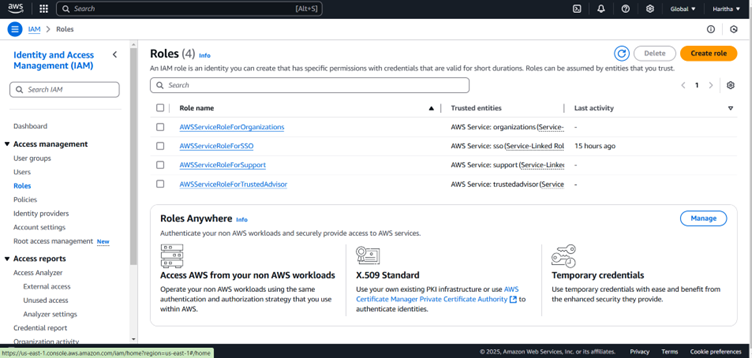
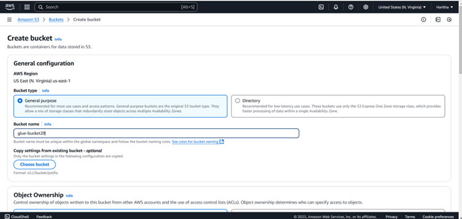
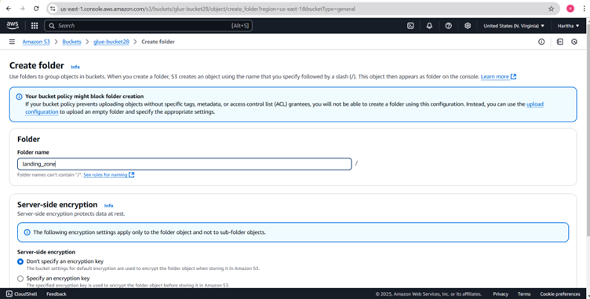
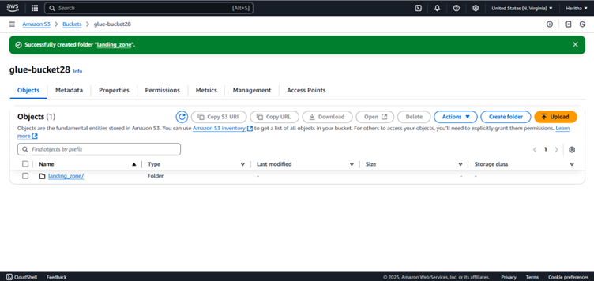
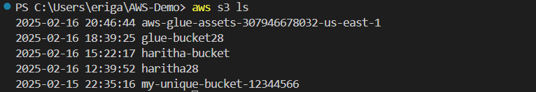
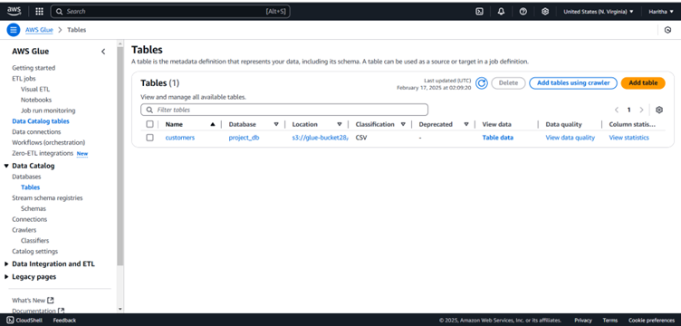

# AWS
# AWS CLI, IAM, S3, AWS Glue ,Catlog, Amazon Athena , RDS

## AWS CLI
AWS Command Line Interface (CLI) is a tool that enables users to interact with AWS services using command-line commands. It provides an efficient and automated way to manage AWS resources without using the AWS Management Console. The AWS CLI supports multiple operating systems and can be integrated into scripts and automation workflows.

### Features of AWS CLI:
- Simplifies interaction with AWS services.
- Supports automation through scripts.
- Cross-platform compatibility (Windows, macOS, Linux).
- Configurable with multiple profiles and credentials.

### Importance of AWS CLI:
- Reduces the time required for managing AWS services.
- Enhances automation and scalability of cloud-based operations.
- Helps in bulk operations and batch processing of AWS resources.

### Basic AWS CLI Commands:
- aws configure – Configures the AWS CLI with access key, secret key, region, and output format.
- aws s3 ls – Lists S3 buckets.
- aws ec2 describe-instances – Retrieves details of EC2 instances.
- aws iam list-users – Lists IAM users in the AWS account.

## AWS IAM (Identity and Access Management)
AWS IAM is a security service that enables organizations to manage user access to AWS resources securely. It helps define **who** can access **what** AWS resources and under **what conditions**.

### Key Concepts of IAM:
- **IAM Users:** Represent individuals who have access to AWS resources.
- **IAM Groups:** Collections of IAM users with similar access permissions.
- **IAM Roles:** Temporary permissions that can be assigned to users or AWS services.
- **IAM Policies:** JSON-based permissions that define access rules.
- **MFA (Multi-Factor Authentication):** Enhances security by requiring additional authentication steps.

### Benefits of IAM:
- Improves security and access control.
- Helps enforce least privilege principles.
- Enables centralized user management and monitoring.

## Amazon S3 (Simple Storage Service)
Amazon S3 is an object storage service that provides highly scalable, secure, and durable cloud storage for a wide range of applications.

### Key Features of S3:
- **Scalability:** Handles unlimited data storage.
- **Durability:** Offers 99.999999999% (11 9’s) durability.
- **Security:** Supports encryption, IAM policies, and bucket policies.
- **Lifecycle Management:** Automatically transitions objects to different storage classes.
- **Versioning:** Keeps multiple versions of an object to protect against accidental deletions.

### Use Cases of Amazon S3:
- Backup and disaster recovery.
- Hosting static websites and media content.
- Data archiving and long-term storage.
- Big data analytics and machine learning.

## AWS Glue
AWS Glue is a serverless data integration service that simplifies the process of discovering, preparing, and transforming data for analytics and machine learning applications.It is commonly used for ETL (Extract, Transform, Load) workflows.

### Components of AWS Glue:
- **Glue Data Catalog:** A centralized repository that stores metadata about datasets.
- **Glue Crawlers:** Automatically scans data sources to create metadata.
- **Glue ETL Jobs:** Processes data using Python or Apache Spark-based transformations.
- **Glue Triggers:** Automates job execution based on schedules or events.

### Benefits of AWS Glue:
- Automates data preparation and transformation.
- Reduces operational overhead with a fully managed service.
- Integrates seamlessly with AWS analytics and data lakes.
- Supports multiple data formats and storage options.

### Common Use Cases:
- Extracting, transforming, and loading (ETL) data for analytics.
- Creating and managing data catalogs for data lakes.
- Integrating with Amazon Redshift, S3, and other AWS services for data processing.

### Glue Database:
- In AWS Glue, a database is a logical container used to organize and store metadata about your data. It does not store the actual data but keeps track of where data is stored (e.g., in Amazon S3), its schema, and other relevant information.

## Key Features of an AWS Glue Database:
- Metadata Storage: Stores table definitions, schemas, and data locations in the AWS Glue Data Catalog.
- Logical Organization: Helps categorize tables based on use cases, projects, or departments.
- Integration with Other AWS Services: Works with Athena, Redshift Spectrum, and EMR for querying and processing data.
- Supports Multiple Data Sources: Can store metadata for data stored in Amazon S3, RDS, Redshift, DynamoDB, and external sources.

- Create an AWS Glue database named "project_db".
- Within this database, define tables such as "customers", "orders", and "products".
- Query these tables using AWS Athena or process them using AWS Glue ETL jobs.

### AWS Glue Tables
- Key Components of an AWS Glue Table
- Table Name – A unique name identifying the table within an AWS Glue database.
- Database – Every table belongs to a specific Glue database, which acts as a logical grouping.
- Schema (Column Definitions) – Defines column names, data types (e.g., string, integer, timestamp), and partition keys.
- Data Format – Specifies the format of the stored data, such as Parquet, ORC, Avro, JSON, CSV, etc..
- Location – The S3 path or data source location where the actual data resides.
- Partitioning (Optional) – Helps improve query performance by organizing data into partitions (e.g., by year, month, or region).
- Input/Output Format – Defines how data should be read and written (e.g., using Apache Hive SerDe for CSV or Parquet).

### AWS Glue Crawlers
AWS Glue crawlers are automated tools that scan data sources, infer their schema, and create or update metadata tables in the AWS Glue Data Catalog. They help maintain an up-to-date schema without manual intervention.

### AWS Glue Connectors
AWS Glue Connectors enable seamless data integration between AWS Glue and external data sources, such as databases, SaaS applications, and other cloud services. These connectors simplify ETL (Extract, Transform, Load) workflows by providing pre-built integrations with various data systems.

### AWS Glue Triggers
AWS Glue Triggers are used to automate the execution of AWS Glue ETL jobs or workflows based on events, schedules, or job dependencies.

###Types of AWS Glue Triggers
- On-Demand Triggers
Manually start an AWS Glue job.

- Scheduled Triggers
Run Glue jobs at fixed intervals (cron expressions or rate-based schedules).

- Event-Based (Job-Completion) Triggers
Automatically start a Glue job when another job succeeds, fails, or stops.

- AWS Glue can be triggered by Amazon EventBridge or AWS Lambda functions.
Example: Start a Glue job when a new file is uploaded to an S3 bucket.

### Amazon Athena
Amazon Athena is an interactive query service that enables you to analyze large datasets directly in Amazon S3 using SQL. It's serverless, meaning you don't need to set up or manage any servers. Athena automatically scales to handle your queries, and you only pay for the amount of data scanned."

"Some of the key features of Athena include:

- Serverless architecture - No need for infrastructure management.
- SQL support - Query your data using standard SQL syntax.
- Cost-effective - You pay only for the data you query.
- Integrated with AWS services - It integrates easily with other services like AWS Glue and Amazon S3."

### How Athena Works
- Data stored in Amazon S3
- Schema defined using AWS Glue or manually
- Queries executed via Athena console, SDK, or JDBC/ODBC
- Results stored back in S3 or integrated with BI tools

### Setting Up Amazon Athena

To use Amazon Athena, the data you want to query needs to be stored in Amazon S3. Athena queries this data directly, and there’s no need to load or move the data into Athena itself. You define tables in Athena that point to this S3 data.

- Creating a Database: Athena requires you to define a logical database. A database is a container for tables, where you store your schema information.
- Creating a Table: Athena tables are defined over data stored in Amazon S3. A table maps the structure of your data (such as the columns and their types) to a data location in S3. Athena can read several formats like CSV, JSON, or Parquet.

### AWS RDS
AWS RDS (Relational Database Service) is a fully managed database service provided by Amazon Web Services (AWS). It helps you set up, operate, and scale a relational database in the cloud with ease.

PostgreSQL is an open-source, object-relational database system that has advanced features and a rich extension ecosystem. AWS offers PostgreSQL as a managed service through Amazon RDS, which automates common database management tasks such as backups, patching, and scaling.

### Key Features of AWS RDS PostgreSQL:

- Managed Service: No need to manage the database infrastructure, backups, or patches.
- Scalability: Easily scale the database to handle growing workloads.
- Automated Backups: RDS automatically performs backups of your database and allows you to restore to any point within the retention period.
- High Availability: RDS offers Multi-AZ deployments, providing automatic failover for high availability.
- Security: Includes encryption at rest and in transit, IAM authentication, and Virtual Private Cloud (VPC) support.

### Thank you for this opportunity

